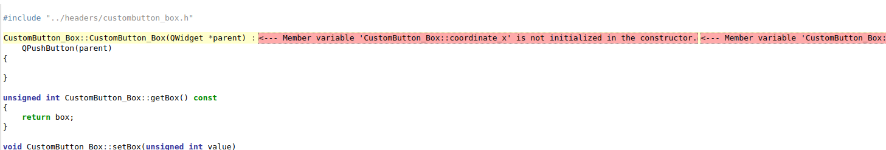
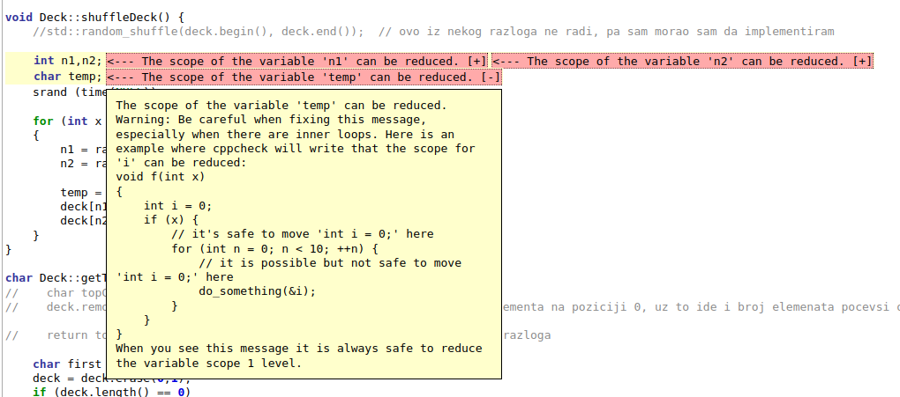
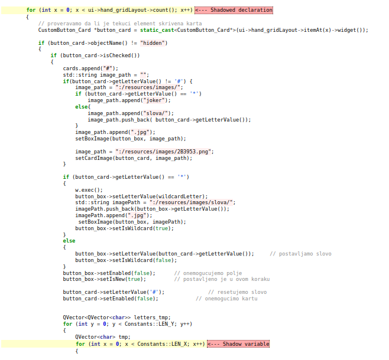
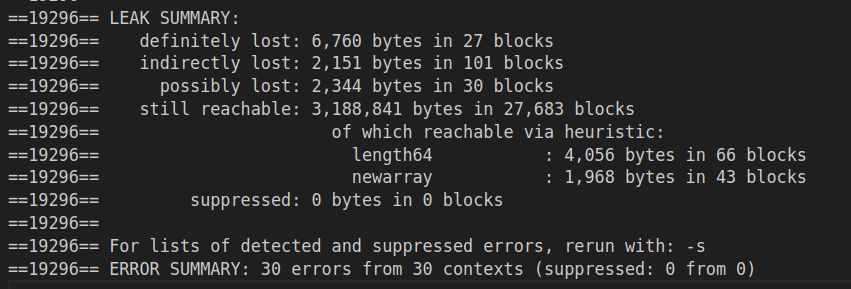
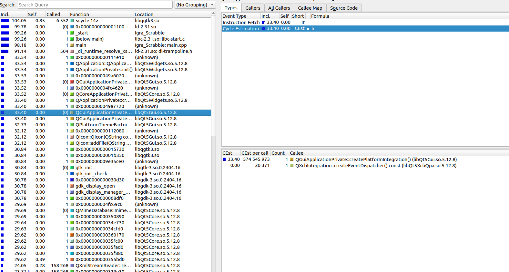
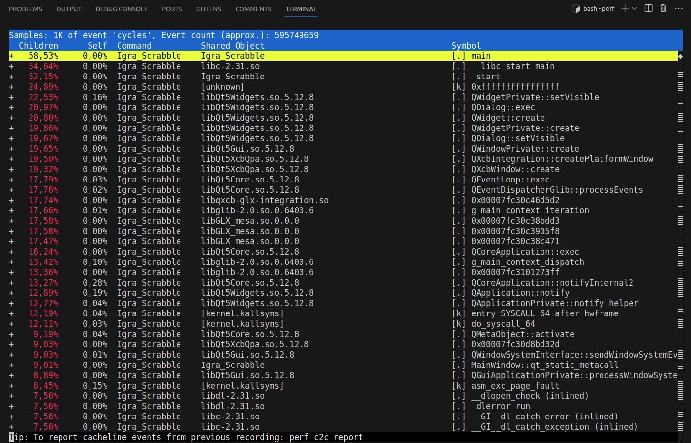
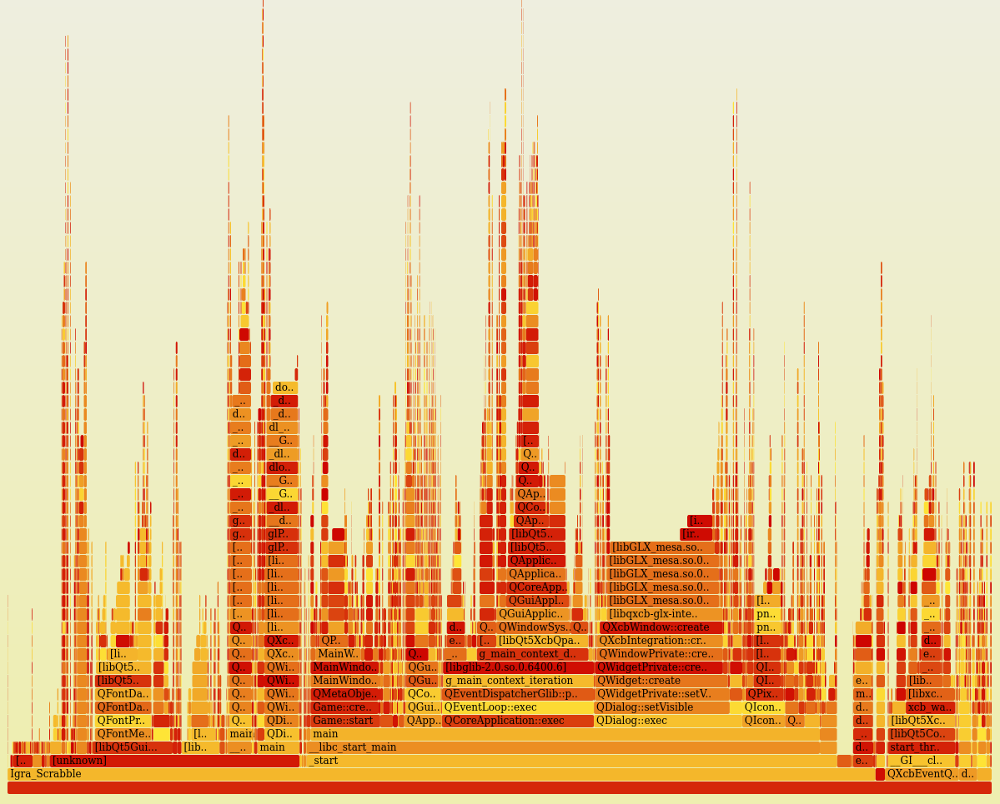

# Izveštaj sprovedene analize

Korišćeni alati:
- [Clang-tidy](#clang-tidy)
- [Cppcheck](#cppcheck)
- [Valgrind alati](#valgrind)
    - [Memcheck](#memcheck)
    - [Callgrind](#callgrind)
- [Perf](#perf)

## Clang-tidy
*Clang-tidy* je alat za statičku analizu koda, deo Clang kompajlera, koji je deo LLVM projekta.

Ovaj alat je dizajniran sa ciljem da pruži preporuke za poboljšanje koda na osnovu određenih pravila ili smernica za programiranje. Cilj je otkriti potencijalne greške, nepoželjne obrasce ili loše prakse u kodu tokom kompajliranja, pre nego što se program pokrene.

Korišćenje *clang-tidy*-a može pomoći programerima da otkriju i isprave probleme u kodu pre nego što stignu do faze testiranja ili izvršavanja programa.

Alat koristi različite provere, poput provera stila koda, bezbednosti, performansi i drugih, kako bi analizirao izvorni kod. Po potrebi, možemo uključiti ili isključiti željene provere.

### Postupak analize
Ovaj alat smo za analizu koristili preko QtCreator razvojnog okruženja za neke od .cpp fajlova koji čine projekat, prateći postupak pokretanja iz [README.md](clang-tidy/README.md).  
Analizirani fajlovi: *board.cpp*, *card.cpp*, *deck.cpp*, *game.cpp*, *mainwindow.cpp*, *wildcard_dialog.cpp*. 

### Zaključci
Često upozorenje koje alat daje jeste izbegavanje korišćenja tzv. *"magičnih brojeva"* u kodu i umesto toga predlaže zamenu imenovanim konstantama i promenljivama.  
Ovu grešku alat uočava, recimo, na primeru dela koda iz fajla *board.cpp* ( Referenca: [magic_numbers.png](clang-tidy/findings/magic_numbers.png) ):  

```c++
if (ind2xWord)
    score = score *2;
if (ind3xWord)
    score = score *3; 
if (WORD.length() == 6)
    score += 10; 
if (WORD.length() == 7)
    score += 30; 
if (WORD.length() == 8)
    score += 50; 
if (WORD == "SCRABBLE")
    score += 100;
if (!existsWildCard)    
    score += 10;                          
```
Poboljšanje bi moglo da izgleda ovako:
```c++
if (ind2xWord)
    score *= 2;

if (ind3xWord)
    score *= 3;

// Postavljanje bonusa za dužinu reči
const std::size_t wordLength = WORD.length();

const int bonus6 = 10;
const int bonus7 = 30;
const int bonus8 = 50;

if (wordLength == 6)
    score += bonus6;
else if (wordLength == 7)
    score += bonus7;
else if (wordLength == 8)
    score += bonus8;

const std::string SCRABBLE_WORD = "SCRABBLE";
const int bonusSCRABBLE = 100;

if (WORD == SCRABBLE_WORD)
    score += bonusSCRABBLE;

const int bonusNoWildCard = 10;

if (!existsWildCard)
    score += bonusNoWildCard;

```
Ovde smo uveli imenovane konstante bonus6, bonus7, bonus8, bonusSCRABBLE, i bonusNoWildCard kako bismo zamenili tvrdo kodirane numeričke vrednosti. Ovo čini kod čitljivijim i omogućava lako ažuriranje vrednosti bonusa u budućnosti, jer se sada vrednosti nalaze na jednom mestu u kodu. Takođe smo uveli imenovane konstante SCRABBLE_WORD i wordLength kako bismo smanjili ponovno izračunavanje dužine reči i reči "SCRABBLE".

Kada koristimo imenovane konstante umesto *"magičnih brojeva"*, zapravo dajemo bolji smisao ovim numeričkim vrednostima tako što im dajemo imena koja opisuju njihovu svrhu ili ulogu u programu. Ovaj pristup čini kod čitljivijim i održljivijim.

Takođe, jedan od čestih pronalazaka je i nedostatak *trailing return type* -a za funkcije.   
*Trailing return types* (tipovi sa povratnom vrednošću na kraju) su moderna karakteristika C++ - a koja je uvedena u C++11 i omogućava nam da deklarišimo tip povratne vrednosti funkcije nakon liste parametara koristeći sintaksu ->.  
Ovo upozorenje spada u kategoriju "modernizacija" provera u clang-tidy alatu. Alat predlaže izmenu kako bi se kod uskladio sa modernim praksama u C++ - u.

Recimo, u fajlu *deck.cpp*:
```c++
bool Deck::isEmpty() {
    return empty;
}
```
Gore navedeni kod menjamo sa:
```c++ 
auto Deck::isEmpty() const -> bool {
    return empty;
}
```
U ovom primeru, **auto** se koristi kao zamena za eksplicitno navođenje tipa povratne vrednosti. 

U *wildcard_dialog.cpp* fajlu sledeća linija je prouzrkovala dva upozorenja:
```c++
QPushButton *button = static_cast<QPushButton*>(ui->gridLayout_Wildcard->itemAt(x)->widget());
```
Menjamo kod:
```c++
auto *button = dynamic_cast<QPushButton*>(ui->gridLayout_Wildcard->itemAt(x)->widget());
```
Ova izmena koristi **dynamic_cast** umesto **static_cast** kako bi sigurno vršila dinamičko kastovanje iz bazne klase u izvedenu klasu. Takođe koristi **auto** kako bi automatski odredila tip promenljive na osnovu rezultata dinamičkog kastovanja, čime se eliminiše potreba za eksplicitnim navođenjem tipa.  
Generalno, u kodu imamo nedovoljno korišćenje **auto** prilikom inicijalizacije pokazivača sa **new**. Na taj način bismo mogli da izbegnemo ponovno navođenje tipa.

U fajlu *game.cpp* često se javlja nepotrebna inicijalizacija niske.   
Na primer, ovakva inicijalizacija niske je suvišna:
```c++
std::string word = "";
```
Ako odmah nakon toga dajemo vrednost niski, kao u primeru:
```c++
word = "neka_vrednost";
```
Da bismo rešili ovo upozorenje, jednostavno treba izostaviti praznu inicijalizaciju i odmah dodeliti vrednost.

Takodje u programu je na par mesta korišćena klasična **for petlja**, te nam analiza predlaže korišćenje **for each** petlje.   
Ovaj pristup često poboljšava čitljivost koda i smanjuje mogućnost grešaka vezanih za indekse u petljama.

Na jednom mestu, u *game.cpp*, imamo i potencijalno curenje memorije ( Referenca: [memory_leak.png](clang-tidy/findings/memory_leak.png) ).  
Ako se promenljiva *constants* alocira dinamički pomoću new, trebalo bi se pobrinuti da se memorija oslobodi nakon što više nije potrebna.
```cpp
Constants* constants = new Constants();

// Dealokacija memorije nakon upotrebe
delete constants;
```

Uopšteno posmatrano, primenom statičke analize clang-tidy alatom sa odabranom konfiguracijom, identifikovali smo brojne prilike za unapređenje u kodu. Identifikovana su mesta gde se mogu primeniti moderni pristupi u C++ programiranju, uključujući preporučene tehnike poput korišćenja auto i range-based for petlji. Ovi saveti ne samo da doprinose bezbednijem i modernijem kodu, već takođe naglašavaju strategije za poboljšanje čitljivosti, efikasnije rukovanje niskama i smanjenje potencijalnih rizika od grešaka, posebno u vezi sa indeksiranjem i upravljanjem memorijom.

## Cppcheck
Cppcheck je alat za statičku analizu C i C++ koda, čija je osnovna uloga otkrivanje potencijalnih problema pre pokretanja programa. Pruža programerima informacije o kvalitetu njihovog koda, pa time olakšava proces poboljšanja. Ovaj alat je posebno koristan za pronalaženje curenja memorije, otkrivanje neinicijalizovanih promenljivih, identifikaciju potencijalnih problema s pokazivačima, te pomoć u održavanju konzistentnosti koda.

Jednostavnost korišćenja, jasni izveštaji, mogućnost vizualizacije rezultata kao i jednostavno postavljanje pravila i filtera čine cppcheck jako korisnim alatom koji doprinosti efikasnijem procesu razvoja.

### Postupak analize
Cppcheck smo za analizu koristili preko terminala prateći postupak pokretanja iz [README.md](cppcheck/README.md).  

### Zaključci

Alat nam daje do znanja da na par mesta u kodu imamo neinicijalizovane promenjive u konstruktoru.   
Korisna funkcionalnost HTML izveštaja je povezivanje prijavljenog upozorenja sa tačnim mestom u kodu gde je isto pronađeno.  
Recimo, klikom na .cpp fajl u kom je pronađena greška `Member variable 'CustomButton_Box::coordinate_x' is not initialized in the constructor.` dobijamo:



Takođe, alat nam sugeriše da možemo smanjiti opseg pojedinih promenljivih. Umesto definisanja dve promenljive u istoj deklaraciji, možemo ih definisati odvojeno ako se koriste u različitim delovima koda, ili kasnije u kodu, kao npr u fajlu *deck.cpp*:



Često upozorenje je i tzv. *"senčanje" (shadowing)* promenljivih. Javlja se kada imamo dve promenljive s istim imenom u istom opsegu, što može dovesti do nesporazuma u čitanju i održavanju koda.   
Na primer u fajlu *mainwindow.cpp* promenljiva *x* se koristi i u spoljašnjoj i u unutrašnjoj petlji, te dolazi do njenog senčanja:



Ovo se može izbeći promenom imena promenljivih u jednoj od dve petlje.

Na par mesta alat prikazuje da ima funkcija koje nisu nigde korišćene, kao i jednu sintaksnu grešku:

```cpp
#if !CATCH_ARC_ENABLED
    [pool drain]; <--- syntax error
#endif
```
Ako koristimo ARC (*Automatic Reference Counting*), možemo ukloniti liniju [pool drain];, a upravljanje *autorelease pool*-om će se automatski obavljati. 

Posmatrajući sveukupnu analizu koda, primećene su određene tačke koje se mogu poboljšati. Preporučuje se izbegavanje senčanja promenljivih, jasnije imenovanje promenljivih i pažljiva organizacija koda kako bi se poboljšala čitljivost. Takođe, preporučuje se inicijalizacija članica klasa u konstruktoru kako bi se eliminisala upozorenja o neinicijalizovanim promenljivama.    
Ova poboljšanja mogu značajno doprineti održivosti i čitljivosti koda.

## Valgrind

Valgrind je svestran alat za dinamičku analizu mašinskog koda, snimljenog kao objektni modul ili izvršivi program. Ova platforma omogućava automatsko otkrivanje problema sa memorijom i procesima, čineći ga ključnim za otkrivanje i ispravljanje grešaka u softverskim aplikacijama.   
Pored toga, Valgrind se može koristiti i kao alat za stvaranje novih alata, a distribucija uključuje nekoliko korisnih alata kao što su: 
- Memcheck (koristi se za detektovanje memorijskih grešaka)
- Massif (koristi se za praćenje rada dinamičke memorije)
- Callgrind (koristi se za profajliranje funkcija)
- Cachegrind (koristi se za profajliranje ke[ memorije])
- Helgrind i DRD (koristi se kao detektor grešaka u radu sa nitima)

Iako Valgrind pruža izuzetno korisne informacije, analiza programa ovim alatom može rezultirati povećanjem vremena izvršavanja programa, obično između 5 i 100 puta. 

U sklopu naše analize, koristićemo dva Valgrind alata: Memcheck i Callgrind.

## Memcheck
Valgrind-ov alat *Memcheck* je moćan alat koji pomaže u  identifikaciji curenja memorije, čitanju neinicijalizovane memorije i otkrivanju drugih grešaka vezanih za upravljanje memorijom u programima napisanim u C i C++ -u.  
Memcheck, kroz instrumentalizaciju izvršnog fajla, otkriva probleme koji mogu dovesti do nepredvidivog ponašanja programa, pružajući programerima detaljne informacije kako bi poboljšali stabilnost i pouzdanost svog koda.

### Postupak profajliranja
Iako je moguće pokrenuti alat i iz QtCreator okruženja, Memcheck smo za analizu koristili preko terminala prateći postupak pokretanja iz [README.md](memcheck/README.md).  

### Zaključci

Gledamo izveštaj u kom možemo videti ukupnu količinu definitivno izgubljene memorije, indirektno izgubljene memorije, potencijalno izgubljene memorije i memorije kojoj se još uvek može pristupiti:



Zaključujemo da je broj definitvno izgubljenih blokova, u odnosu na ukupan broj blokova, relativno mali. 
Većina blokova koji su izgubljeni nemaju veze sa izvornim kodom programa, već potiču iz biblioteka koje program koristi.

Jedini slučajevi gde imamo curenje memorije u izvornom kodu, jesu:  


U oba slučaja, memorija je alocirana operatorom **new** u okviru **Board::Board()** konstruktora ( *board.cpp* fajl ). Trebalo bi da se obezbedi da se memorija alocirana putem operatora **new** u konstruktoru **Board::Board()** pravilno dealocira, recimo implementacijom destruktora u klasi **Board**.

U izvornom kodu programa nemamo nedozvoljeno oslobadjanje memorije, kao ni prosleđivanje neinicijalizovanih vrednosti sistemskim pozivima.

## Callgrind

*Callgrind* je alat koji generiše listu poziva funkcija korisničkog programa u vidu grafa. U osnovnim podešavanjima
sakupljeni podaci sastoje se od broja izvršenih instrukcija, njihov odnos sa linijom u izvršnom kodu, odnos pozivaoc/pozvan između funkcija, kao i broj takvih poziva.  
Ove informacije mogu biti korisne za pronalaženje tačnih mesta u kodu gde se događa najveće trošenje resursa, pomažući nam u identifikaciji potencijalnih mesta za optimizaciju.

Program *callgrind annotate* na osnovu generisanog izveštaja od strane *callgrind*-a vrši interpretaciju i stvara čitljiv prikaz koji olakšava identifikaciju delova koda koji troše najviše resursa. Izveštaj se prikazuje u obliku anotiranog izvornog koda s dodatnim informacijama o troškovima izvršavanja na svakoj liniji.
Za grafičku vizuelizaciju koristimo dodatni alat *KCachegrind*, koji olakšava navigaciju ukoliko *callgrind* napravi veliku količinu podataka.

### Postupak profajliranja

Callgrind smo koristili preko terminala prateći postupak pokretanja iz [README.md](callgrind/README.md).  

### Zaključci

Najviše zaključaka možemo dobiti posmatrajući vizualizaciju preko KCachegrind-a.   



Zanimaju nas funkcije koje se najviše puta pozivaju. Na levoj strani se nalaze informacije o broju pozivanja svake funkcije i broju instrukcija koje je zahtevalo njeno izvršavanje, samostalno i uključujući izvršavanja drugih funkcija koje je pozivala. Na desnoj strani možemo izabrati opciju *All Callers* i videćemo koje sve funkcije su pozivale funkciju koja nas zanima. Takodje možemo dobiti i graf poziva funkcije opcijom *Call Graph*. [Primer](callgrind/KCacheGrind/full_report.png).

Na osnovu posmatranja izveštaja, opšti utisak je da nema velikog broja poziva funkcija u delu koji je implementiran od strane programera ovog projekta.

## Perf
Alat *perf* predstavlja moćan alat za analizu performansi na Linux sistemima. Ovaj alat omogućava programerima da analiziraju performanse njihovog koda kako bi identifikovali potencijalne uzroke sporosti ili resurskih problema.  
Glavna upotreba alata Perf je identifikacija i eliminacija uskih grla u performansama softverskog sistema. Kroz analizu podataka o vremenu izvršavanja, programeri mogu pronaći delove koda koji zahtevaju optimizaciju, kao i lokacije gde se resursi (CPU, memorija, disk itd.) troše neefikasno.  

U kombinaciji sa alatom *perf* koristi se često *FlameGraph* - moćan vizuelni alat. FlameGraph pruža intuitivan prikaz vremena izvršavanja različitih delova koda u obliku "*plamenog grafa*".   
Ovaj grafički prikaz olakšava identifikaciju glavnih uzroka usporenja i optimizaciju koda.
Kada se koristi u vezi sa perf alatom, FlameGraph pruža detaljan uvid u profilisanje performansi, omogućavajući programerima da brzo identifikuju gde se resursi troše i koje funkcije uzimaju najviše vremena tokom izvršavanja programa.

### Postupak profajliranja
Perf smo za analizu koristili preko terminala prateći postupak pokretanja iz [README.md](perf/README.md).  

Perf se može koristiti za prikupljanje profila (sampling) na nivou niti, procesa ili CPU kroz komande `record`, `report` i `annotate`. Profili će podrazumevao biti sačuvani u fajlu `perf.data` i mogu biti analizirani koristeći komande `report` i `annotate`. Upravo ćemo ovu funkcionalnost iskoristiti u našoj analizi.

Za vizuelizaciju podataka dobijenih naredbom `perf report` koristićemo gore pomenuti "*plameni graf*".

### Zaključci
Na slici ispod možemo videti rezultat poziva:
```bash
sudo perf record --call-graph dwarf ../Igra_scrabble/build/Igra_Scrabble
sudo perf report 
```
Koristili smo `perf record` komandu sa opcijom `--call-graph dwarf` da bi generisali graf poziva koji prikazuje kako se funkcije pozivaju međusobno.  



Kolona "*Self*" prikazuje procenat vremena provedenog direktno u trenutnoj funkciji u odnosu na ukupno vreme izvršavanja programa.  
Prema izveštaju nemamo funkciju koja preveliki procenat vremena troše u svom sopstvenom kontekstu.  

U koloni "*Children*" vidimo procente koji ukazuju na procentualni udeo vremena provedenog u pozivanim funkcijama u odnosu na ukupno vreme provedeno u trenutnoj funkciji. Ova vrednost prikazuje koliki je doprinos pozvanih funkcija ukupnom vremenu provedenom u trenutnoj funkciji.  
Gledajući izveštaj, očekivano je da je broj izvršavanje dece funkcije *main* najveći. Takodje, postoji još par funkcija gde se može razmotriti optimizacija broja poziva, medjutim uglavnom je prijavljeno ponašanje u skladu sa funkcionalnostima.

Dijagram prikazuje populaciju uzoraka na x osi, a dubinu steka na y osi. Svaka funkcija je jedan pravougaonik, širine relativne broju uzoraka. 




## Zaključak

Kroz analizu projekta i posmatranje svih pronalaska upotrebljenih alata opšti zaključak je da u projektu nisu pronađeni veći propusti koji mogu značajno uticati na njegovu funkcionalnost. 

Treba istaći koliko je primena alata za verifikaciju važan deo razvoja softvera.   
Kroz jednostavnu integraciju ovih alata u projekat, identifikujemo greške kao što su curenje memorije, smanjena čitljivost i redudantnost koda, koje u nekim scenarijima mogu imati ozbiljne posledice.  
Redovno testiranje tokom procesa programiranja ima ključnu ulogu u smanjenju verovatnoće pojave grešaka.