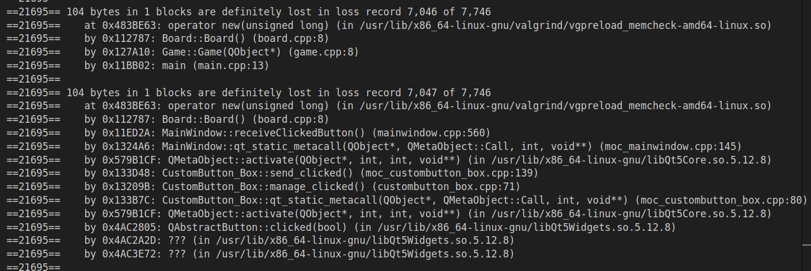

# Izveštaj sprovedene analize

Korišćeni alati:
- [Clang-tidy](#clang-tidy)
- [Valgrind alati](#valgrind)
    - [Memcheck](#memcheck)
    - [Callgrind](#callgrind)
- [Perf](#perf)

## Clang-tidy
*Clang-tidy* je alat za statičku analizu koda, deo Clang kompajlera, koji je deo LLVM projekta.

Ovaj alat je dizajniran sa ciljem da pruži preporuke za poboljšanje koda na osnovu određenih pravila ili smernica za programiranje. Cilj je otkriti potencijalne greške, nepoželjne obrasce ili loše prakse u kodu tokom kompajliranja, pre nego što se program pokrene.

Korišćenje *clang-tidy*-a može pomoći programerima da otkriju i isprave probleme u kodu pre nego što stignu do faze testiranja ili izvršavanja programa.

Alat koristi različite provere, poput provera stila koda, bezbednosti, performansi i drugih, kako bi analizirao izvorni kod. Po potrebi, možemo uključiti ili isključiti željene provere.

### Postupak analize
Ovaj alat smo za analizu koristili preko QtCreator razvojnog okruženja na neke od .cpp fajlova koji čine projekat, prateći postupak pokretanja iz [README.md](clang-tidy/README.md).  
Analizirani fajlovi: *board.cpp*, *card.cpp*, *deck.cpp*, *game.cpp*, *mainwindow.cpp*, *wildcard_dialog.cpp*. 

### Zaključci
Često upozorenje koje alat daje, jeste izbegavanje korišćenja tzv. *"magičnih brojeva"* u kodu i umesto toga predlaže zamenu konstantama i promenljivama. Recimo, na primeru dela koda iz fajla *board.cpp* (Referenca:[magic_numbers.png](clang-tidy/findings/magic_numbers.png)):  

```c++
if (ind2xWord)
    score = score *2;
if (ind3xWord)
    score = score *3; 
if (WORD.length() == 6)
    score += 10; 
if (WORD.length() == 7)
    score += 30; 
if (WORD.length() == 8)
    score += 50; 
if (WORD == "SCRABBLE")
    score += 100;
if (!existsWildCard)    
    score += 10;                          
```
Poboljšanje bi moglo da izgleda ovako:
```c++
if (ind2xWord)
    score *= 2;

if (ind3xWord)
    score *= 3;

// Postavljanje bonusa za dužinu reči
const std::size_t wordLength = WORD.length();

const int bonus6 = 10;
const int bonus7 = 30;
const int bonus8 = 50;

if (wordLength == 6)
    score += bonus6;
else if (wordLength == 7)
    score += bonus7;
else if (wordLength == 8)
    score += bonus8;

const std::string SCRABBLE_WORD = "SCRABBLE";
const int bonusSCRABBLE = 100;

if (WORD == SCRABBLE_WORD)
    score += bonusSCRABBLE;

const int bonusNoWildCard = 10;

if (!existsWildCard)
    score += bonusNoWildCard;

```
Ovde smo uveli imenovane konstante bonus6, bonus7, bonus8, bonusSCRABBLE, i bonusNoWildCard kako bismo zamenili tvrdo kodirane numeričke vrednosti. Ovo čini kod čitljivijim i omogućava lako ažuriranje vrednosti bonusa u budućnosti, jer se sada vrednosti nalaze na jednom mestu u kodu. Takođe smo uveli imenovane konstante SCRABBLE_WORD i wordLength kako bismo smanjili ponovno izračunavanje dužine reči i reči "SCRABBLE".

Kada koristimo *imenovane konstante* umesto *"magičnih brojeva"*, zapravo pridajemo smisao ovim numeričkim vrednostima tako što im dajemo imena koja opisuju njihovu svrhu ili ulogu u programu. Ovaj pristup čini kod čitljivijim i održivijim.

Takođe, jedan od čestih pronalazaka je i nedostatak *trailing return type* -a za funkcije.   
*Trailing return types* (tipovi sa povratnom vrednošću na kraju) su moderna karakteristika C++ - a koja je uvedena u C++11 i omogućava nam da deklarišimo tip povratne vrednosti funkcije nakon liste parametara koristeći sintaksu ->.  
Ovo upozorenje spada u kategoriju "modernizacija" provera u clang-tidy alatu. Alat predlaže izmenu kako bi se kod uskladio sa modernim praksama u C++ - u.

Recimo, u fajlu *deck.cpp*:
```c++
bool Deck::isEmpty() {
    return empty;
}
```
Menjamo sa:
```c++ 
auto Deck::isEmpty() const -> bool {
    return empty;
}
```
U ovom primeru, **auto** se koristi kao zamena za eksplicitno navođenje tipa povratne vrednosti. 

U *wildcard_dialog.cpp* fajlu sledeća linija je prouzrkovala dva upozorenja:
```c++
QPushButton *button = static_cast<QPushButton*>(ui->gridLayout_Wildcard->itemAt(x)->widget());
```
Menjamo kod:
```c++
auto *button = dynamic_cast<QPushButton*>(ui->gridLayout_Wildcard->itemAt(x)->widget());
```
Ova izmena koristi **dynamic_cast** umesto **static_cast** kako bi sigurno vršila dinamičko kastovanje iz bazne klase u izvedenu klasu. Takođe koristi **auto** kako bi automatski odredila tip promenljive na osnovu rezultata dinamičkog kastovanja, čime se eliminiše potreba za eksplicitnim navođenjem tipa.
Generalno, u kodu imamo nedovoljno korišćenje **auto** prilikom inicijalizacije pokazivača sa new. Na taj način možemo izbeći ponovno navođenje tipa.

U fajlu *game.cpp* često se javlja nepotrebna inicijalizacija niske.   
Na primer, ovakva inicijalizacija stringa je suvišna:
```c++
std::string word = "";
```
Ako odmah nakon toga dajemo vrednost niski, kao u primeru:
```c++
word = "neka_vrednost";
```
Da bismo rešili ovo upozorenje, jednostavno treba izostaviti praznu inicijalizaciju i odmah dodeliti vrednost.

Takodje u programu je na par mesta korišćena klasična **for** petlja, te nam analiza predlaže korišćenje **for each** petlje. Ovaj pristup često poboljšava čitljivost koda i smanjuje mogućnost grešaka vezanih za indekse.

Na jednom mestu, u *game.cpp* imamo i potencijalno curenje memorije (Referenca: [memory_leak.png](clang-tidy/finding/memory_leak.png)).  
Ako se promenljiva constants alocira dinamički pomoću new, trebalo bi se pobrinuti da se memorija oslobodi nakon što više nije potrebna.
```cpp
Constants* constants = new Constants();

// Dealokacija memorije nakon upotrebe
delete constants;
```

Generalno posmatrano, korišćenjem clang-tidy analize, sa odabranom konfiguracijom, uspeli smo da otkrijemo dosta mesta za poboljšanje u kodu.   
Clang-Tidy pruža uputstva o modernim praksama u C++ programiranju, kao što su korišćenje auto, *range-based for loop* - ova i drugi saveti za pisanje bezbednijeg i modernijeg koda. Takodje, dao je korisne predloge za čitljiviji kod, rad sa niskama kao i smanjivanje rizika od grešaka povezanih sa indeksiranjem i curenjem memorije.

## Valgrind

Valgrind je svestran alat za dinamičku analizu mašinskog koda, snimljenog kao objektni modul ili izvršivi program. Ova platforma omogućava automatsko otkrivanje problema sa memorijom i procesima, čineći ga ključnim za otkrivanje i ispravljanje grešaka u softverskim aplikacijama.   
Pored toga, Valgrind se može koristiti i kao alat za stvaranje novih alata, a distribucija uključuje nekoliko korisnih alata kao što su Memcheck za detekciju memorijskih grešaka, Hellgrind i DRD za detekciju grešaka u višenitnim programima, Cachegrind za optimizaciju keš memorije, Callgrind za generisanje grafa skrivene memorije i predikciju skoka, te Massif za optimizaciju korišćenja dinamičke memorije.   
Iako Valgrind pruža izuzetno korisne informacije, analiza programa ovim alatom može rezultirati povećanjem vremena izvršavanja programa, obično između 20 i 100 puta. 

U sklopu naše analize, koristićemo dva Valgrind alata: Memcheck i Callgrind.

## Memcheck
Valgrind-ov alat Memcheck je moćan alat za analizu memorije koji pomaže identifikaciju curenja memorije, čitanje neinicijalizovane memorije i drugih grešaka vezanih za upravljanje memorijom u programima napisanim u C i C++.  
Memcheck, kroz instrumentaciju izvršnog fajla, otkriva probleme koji mogu dovesti do nepredvidivog ponašanja programa, pružajući programerima detaljne informacije kako bi poboljšali stabilnost i pouzdanost svog koda.

### Postupak analize
Iako je moguće pokrenuti alat i iz QtCreator okruženja, Memcheck smo za analizu koristili preko terminala prateći postupak pokretanja iz [README.md](memcheck/README.md).  

### Zaključci

Gledajući izveštaj, konkretno posmatrajući curenje memorije  
(Referenca: [leak_summary](memcheck/pictures/report.png)), zaključujemo da je broj definitvno izgubljenih blokova, u odnosu na ukupan broj blokova, relativno mali. 
Većina blokova koji su izgubljeni nemaju veze sa izvornim kodom programa, već potiču iz biblioteka koje program koristi. 

Jedini slučajevi gde imamo curenje memorije u izvornom kodu, jesu:  



U oba slučaja, memorija je alocirana operatorom **new** u okviru **Board::Board()** konstruktora (*board.cpp*). Trebalo bi da se obezbedi da se memorija alocirana putem operatora **new** u konstruktoru **Board::Board()** pravilno dealocira, recimo implementacijom destruktora u klasi **Board**.

U izvornom kodu programa nemamo nedozvoljeno oslobadjanje memorije, kao ni prosleđivanje neinicijalizovanih vrednosti sistemskim pozivima.

## Callgrind

### Postupak
### Zaključci

