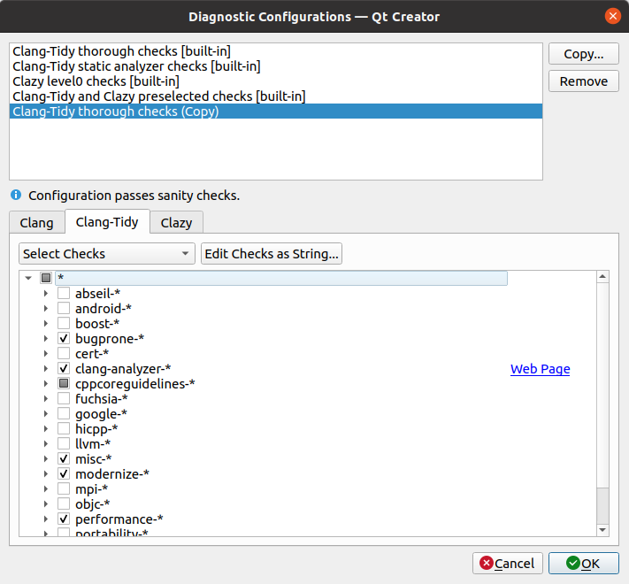
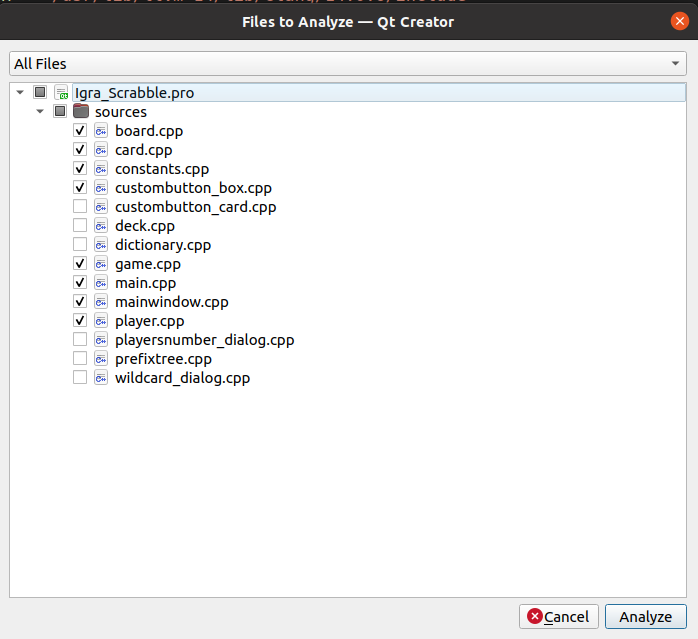
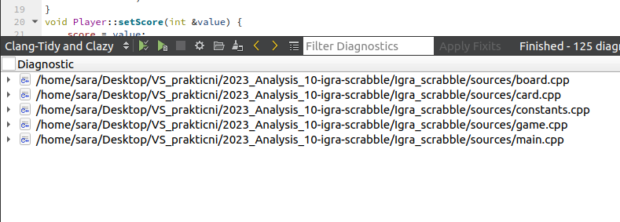
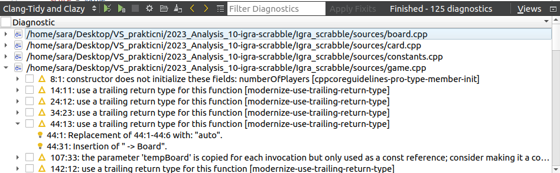

## Analiza pomoću alata Clang-tidy

U nastavku se nalazi uputstvo za izvršavanje statičke analize izabranog projekta kao i snimci ekrana nekih od poruka dobijenih analizatorom Clang-Tidy u okviru okruženja QtCreator.  

Više detalja o samom alatu kao i rezultatima analize možete naći u [ProjectAnalysisReport.md](../ProjectAnalysisReport.md) dokumentu.

### Preduslovi pokretanja
Za pokretanje analize potrebno je instalirati Qt framework, osnovne pakete i alate za razvoj, kao i alat QtCreator.

```bash
sudo apt-get update
sudo apt install build-essential
sudo apt install qtcreator
```
Potrebno je instalirati odgovarajuću verziju clang alata (clang-format-14).  
Poznati problem sa pokretanjem analize: https://github.com/microsoft/vscode-cpptools/issues/9574.

```bash
wget https://apt.llvm.org/llvm.sh
chmod +x llvm.sh
sudo ./llvm.sh 14
sudo apt install clang-format-14
```

### Pokretanje

1. Otvorite QtCreator:
Pokrenite QtCreator, otvorite i izgradite projekat u Debug režimu, klikom na zelenu strelicu u donjem levom uglu.

2. U fajlu `IgraScrabble.pro` dodajte narednu liniju koda (tek nakon što ste pokrenuli projekat):

```bash
INCLUDEPATH += /usr/lib/llvm-14/lib/clang/14.0.6/include
```

3. Otvorite .cpp datoteke u kojima želite izvršiti clang-tidy analizu.

4. Idite na meni *Tools* -> *Options* -> *Analyzer*. U delu *Run Options* izabraćemo *Manage* opciju.   
Kopirajte *Clang-Tidy thorough checks [built-in]* i uključite ili isključite opcije za analizu koje želite.   
U našem slučaju, uključena je i opcija za statičku analizu. Kliknite na *OK*.



3. Kliknite na *Analyze* u glavnom meniju QtCreatora.

4. Izaberite *Clang-Tidy and Clazy..* iz padajućeg menija:
        
5. Izaćiće vam prozor za izbor .cpp fajlova koje želite analizirati. 

  

Odaberite željene fajlove.
       
6. Kada analiza bude gotova, rezultati će biti prikazani u *Diagnostic* prozoru u QtCreatoru, omogućavajući vam pregled pronađenih problema po svakom pojedinačnom .cpp fajlu.



7. Klikom na stavke u rezultatima analize, možete automatski preći na odgovarajući deo koda u odabranim .cpp fajlovima.   
Alat takođe nudi i predloge rešenja pojedinih nađenih problema. 


